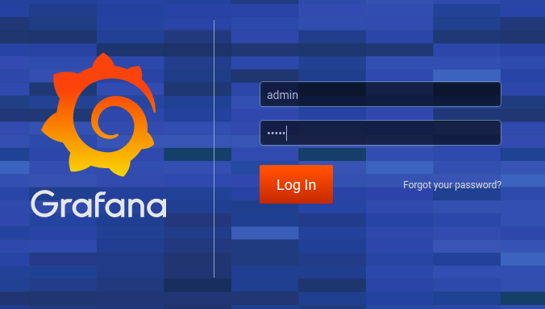

# Raspberry system Data Logger with Grafana visualization
This project aims to monitor Raspberry resource utilization and to provide simple tools to alert and react to critical conditions.
Grafana is used as visualization and alert service.

## Intro
This repository is used to teach students some basic architectural patterns.
The code is not production-ready and you use it at your own risk! :P
The base Architecture follows the microservice patterns and is open to extension but close to modification :P
Other features will be released soon but feel free to open issues to ask them or to ask me questions.

## Pre-requisites
To run Raspy Data Logger you need working **docker** and **docker-compose** installations. 
There are plenty of guides online so you can google for it or just ask me in a issue :)

## How to run
From your Raspberry run the following commands: 

**Clone this repository**
```
git clone https://github.com/Mellgood/raspy-data-logger.git
```
**Change directory into the downloaded one**
```
cd raspy-data-logger/ 
```
**Deploy Raspy Data Logger**
```
docker-compose up -d
```

Now you have to wait until Docker-Compose will end to download and deploy the software.

## Configure Grafana's Dashboard to visualize data
When all the containers will be up and running, you can open Grafana web UI. 
* Using your PC browser, write RASPBERRY-IP-ADDRESS:3000.
* If you have the raspbian desktop, you can open a browser from it and you can digit: localhost:3000

**note:** If you don't know your RASPBERRY-IP-ADDRESS you can find it running on your raspberry:
```
ifconfig
```
Your RASPBERRY-IP-ADDRESS will be listed under the wlan0 (or eth0) interface.

You will get the Grafana login page:



Default user/password are: admin/admin

You can change your default admin's password on the next page.

Now click on "Add data source" button:


Then select the Postgresql database source:


Now you have to fill connection parameters:
* **Host:** database
* **Database:** postgres
* **User:** postgres
* **Password:** raspberry
* **SSL Mode:** disable


Scroll down and click "Save and Test" button. If it turns green you are ok, otherwise double-check connection parameters:


Now let's go back to the homepage using Grafana logo in the upper left corner, then click on "New dashboard" button to
create a new dashboard and finally on "Add Query".


It is time to setup our query so you have to change following parameters, clicking on them:
* **FROM:** temperaturemeasure
* **Time column:** "timestamp"
* **Metric column:** uom
* **SELECT:** Column: temperature


Then you can change time-settings. Recommended are **refresh rate 5s** and show **last 30 minutes**:


Now you can save using the save button (the first on the left shown in previous picture).

You are done! Now you should see first data coming into your Grafana dashboard.
You can play with data visualization settings as you wish.


